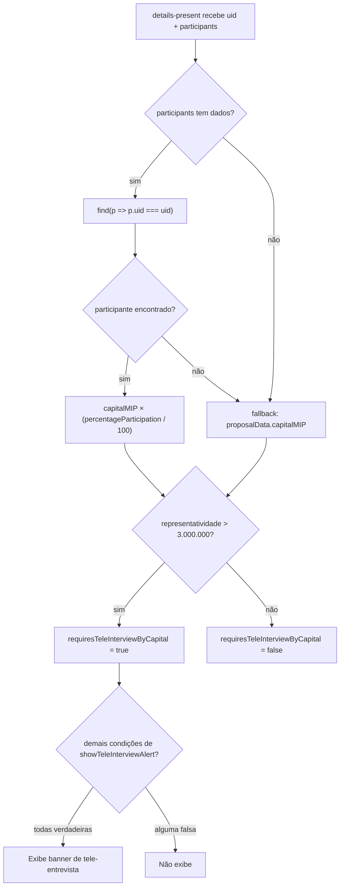

# Fix: Tele-entrevista usa representatividade do capital MIP

## Problema

Em [`details-present.tsx`](src/app/(logged-area)/dps/components/details-present.tsx) (linhas 210–212), `requiresTeleInterviewByCapital` compara `proposalData.capitalMIP` (capital bruto da operação) com o limiar de R$ 3.000.000, ignorando o percentual de participação do participante atual.

## Dado já disponível

O array `participants` (prop já populada em [`details/[uid]/page.tsx`](src/app/(logged-area)/dps/details/[uid]/page.tsx)) contém, para cada participante:
- `percentageParticipation: number` — percentual de participação do participante na operação (vindo de `GET v1/Proposal/participants/{contractNumber}`)

O capital de representatividade é calculado **no front**:

```
capitalMIP_representatividade = proposalData.capitalMIP × (percentageParticipation / 100)
```

O `uid` do participante atual é passado como prop — o mesmo usado em `currentParticipantType`.

## Mudança em `details-present.tsx`

**Arquivo:** [`src/app/(logged-area)/dps/components/details-present.tsx`](src/app/(logged-area)/dps/components/details-present.tsx)

Substituir as linhas 207–212:

```ts
// ANTES
const teleInterviewThreshold = proposalData?.product?.name
    ? getTeleInterviewThresholdByProduct(proposalData.product.name)
    : undefined
const requiresTeleInterviewByCapital =
    typeof teleInterviewThreshold === 'number' &&
    proposalData.capitalMIP > teleInterviewThreshold
```

```ts
// DEPOIS
const teleInterviewThreshold = proposalData?.product?.name
    ? getTeleInterviewThresholdByProduct(proposalData.product.name)
    : undefined
const capitalMIPRepresentatividade = React.useMemo(() => {
    if (participants && participants.length > 0) {
        const current = participants.find(p => p.uid === uid)
        if (current != null) {
            return proposalData.capitalMIP * (current.percentageParticipation / 100)
        }
    }
    return proposalData.capitalMIP
}, [participants, uid, proposalData.capitalMIP])
const requiresTeleInterviewByCapital =
    typeof teleInterviewThreshold === 'number' &&
    capitalMIPRepresentatividade > teleInterviewThreshold
```

> Fallback para `proposalData.capitalMIP` garante que propostas sem participantes (operação simples) continuem funcionando.

## Atualização dos contextos de produto

Atualizar a linha de Teleentrevista nos 3 arquivos de skill afetados para refletir a nova regra:

Os 3 arquivos de produto e a SKILL.md principal recebem atualização na linha de Teleentrevista para refletir que o capital comparado é o de **representatividade** — calculado como `proposalData.capitalMIP × (percentageParticipation / 100)` — e não o capital bruto da operação.

**Arquivo:** [`.cursor/skills/dps-produtos-context/products/habitacional.md`](.cursor/skills/dps-produtos-context/products/habitacional.md)

- Linha 21: atualizar para `Capital de representatividade acima de **R$ 3.000.000** (capitalMIP × percentageParticipation / 100)`

**Arquivo:** [`.cursor/skills/dps-produtos-context/products/home-equity.md`](.cursor/skills/dps-produtos-context/products/home-equity.md)

- Mesma correção na linha 21.

**Arquivo:** [`.cursor/skills/dps-produtos-context/products/construcasa.md`](.cursor/skills/dps-produtos-context/products/construcasa.md)

- Mesma correção na linha 21.

**Arquivo:** [`.cursor/skills/dps-produtos-context/SKILL.md`](.cursor/skills/dps-produtos-context/SKILL.md)

- Linha 33 (tabela "Teleentrevista (limiar)"): adicionar que o capital avaliado é o de representatividade do participante.

## Fluxo após a correção


