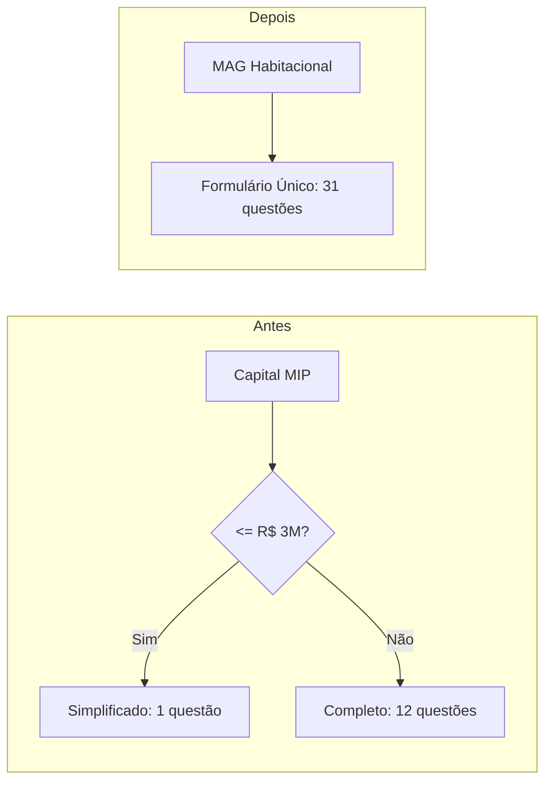

# Formulário Único MAG Habitacional — 31 Questões

## Contexto

Atualmente o formulário MAG Habitacional bifurca em dois tipos baseado no Capital MIP:

- **Simplificado** (capital <= R$ 3M): 1 questão Sim/Não + textarea
- **Completo** (capital > R$ 3M): 10 questões Sim/Não + 2 campos de texto (altura/peso)

A mudança elimina essa bifurcação e cria um formulário único com **31 questões**, todas do tipo Sim/Não + descrição obrigatória quando "Sim".




## Arquivos a alterar (7 arquivos)

### 1. Constante de questões — [src/app/(logged-area)/dps/fill-out/components/dps-form.tsx](src/app/(logged-area)/dps/fill-out/components/dps-form.tsx)

- **Remover** `diseaseNamesMagHabitacionalSimplified` (linhas 86-88) e `diseaseNamesMagHabitacionalComplete` (linhas 91-104)
- **Criar** `diseaseNamesMagHabitacional` com as 31 questões fornecidas (codes '1' a '31')
- **Remover** import de `getDpsTypeByCapital` (linha 13)
- **Remover** imports dos tipos `HealthFormMagHabitacionalSimplified` e `HealthFormMagHabitacionalComplete` (linha 4), substituir por `HealthFormMagHabitacional`
- **Simplificar** processamento de `initialHealthData` (linhas 129-162): remover branch `magDpsType === 'simplified'`, tratar todas as 31 questões uniformemente como `{ has, description }`
- **Simplificar** tipo de `dpsData.health` (linha 178) e `handleHealthSubmit` (linha 262): usar `HealthFormMagHabitacional`
- **Remover** props `dpsType` e `capitalMIP` passados para `DpsHealthForm` (linhas 296-299); manter apenas `productName`

### 2. Formulário de saúde (área logada) — [src/app/(logged-area)/dps/fill-out/components/dps-health-form.tsx](src/app/(logged-area)/dps/fill-out/components/dps-health-form.tsx)

- **Remover** schemas: `productMagHabitacionalSimplified` (linhas 155-170), `productMagHabitacionalComplete` (linhas 173-186), `textFieldSchema` (149), `requiredTextFieldSchema` (152)
- **Criar** schema único `productMagHabitacional` com 31 entradas de `diseaseSchema`:

```typescript
const productMagHabitacional = {
  '1': diseaseSchema, '2': diseaseSchema, /* ... */ '31': diseaseSchema
};
```

- **Remover** `healthFormMagHabitacionalSimplified` e `healthFormMagHabitacionalComplete` (linhas 190-191); criar `healthFormMagHabitacional = object(productMagHabitacional)`
- **Remover** tipos `HealthFormMagHabitacionalSimplified` e `HealthFormMagHabitacionalComplete` (linhas 195-196); criar e exportar `HealthFormMagHabitacional`
- **Remover** props `capitalMIP` e `dpsType` do componente (linhas 204-213)
- **Remover** variável `magDpsType` (linha 222) e `isSimplifiedMag`/`isCompleteMag` (linhas 396-397)
- **Simplificar** `getSchema()` (linhas 225-233): se MAG, retornar `healthFormMagHabitacional`
- **Simplificar** `onSubmit()` (linhas 250-362): remover branches para simplified/complete; todas as 31 questões mapeiam uniformemente para `{ code, question, exists: has === 'yes', description }`
- **Simplificar** aprovação automática (linhas 321-343): `postData.some(item => item.exists === true)` sem distinção de tipo
- **Simplificar** `getQuestions()` e `getQuestionLabel()`: usar `diseaseNamesMagHabitacional`
- **Simplificar** renderização (linhas 416-463): remover branches `isSimplifiedMag`/`isCompleteMag`; todas as 31 questões usam `DiseaseField`
- **Remover** componentes `MagTextField` (linhas 623-672) e `MagSimplifiedField` (linhas 675-810) — não serão mais usados
- **Atualizar** import de `diseaseNamesMagHabitacional` vindo de `dps-form.tsx` (linhas 36-38)

### 3. Formulário externo — [src/app/external/fill-out/components/external-dps-form.tsx](src/app/external/fill-out/components/external-dps-form.tsx)

- **Remover** import de `diseaseNamesMagHabitacionalSimplified` e `diseaseNamesMagHabitacionalComplete` (linha 12); importar `diseaseNamesMagHabitacional`
- **Remover** import de `getDpsTypeByCapital` (linha 13)
- **Remover** componentes `MagTextField` (linhas 112-155) e `MagSimplifiedField` (linhas 158-229)
- **Remover** cálculo de `magDpsType` (linhas 243-245)
- **Simplificar** inicialização de `formData` (linhas 248-325): para MAG, inicializar as 31 chaves como `{ has: '', description: '' }`
- **Remover** `handleTextChange` (linhas 364-375) — não há mais campos de texto puro
- **Simplificar** `validateForm()` (linhas 377-436): para MAG, validar 31 questões como Sim/Não (sem branches simplified/complete)
- **Simplificar** formatação de `postData` no `handleSubmit` (linhas 449-506): uniforme para as 31 questões
- **Simplificar** lógica de aprovação automática (linhas 514-537): `postData.some(item => item.exists === true)`
- **Simplificar** `renderFormFields()` (linhas 716-764): para MAG, iterar sobre `diseaseNamesMagHabitacional` usando `DiseaseField`

### 4. Constantes — [src/constants/index.ts](src/constants/index.ts)

- **Remover** a função `getDpsTypeByCapital` (linhas 175-179)
- **Remover** o export da função nos imports dos outros arquivos

### 5. Tipos de produto — [src/types/product.ts](src/types/product.ts)

- **Simplificar** tipo `dpsConfig` (linhas 35-41): remover `simplifiedThreshold` e estrutura `simplified/complete`:

```typescript
dpsConfig?: {
    questions?: Array<{ code: string; description: string }>;
};
```

### 6. Detalhes da proposta — [src/app/(logged-area)/dps/components/details-present.tsx](src/app/(logged-area)/dps/components/details-present.tsx)

- **Revisar** `showMipAlertMinToMedic` (linhas 779-783) e `showMipAlertCompleteToMedic` (linhas 785-788): estes alertas baseiam-se em faixas de capital para o subscritor médico. Não estão ligados ao tipo de formulário, então **podem ser mantidos** como estão. Apenas confirmar que os thresholds (3M e 5M) continuam válidos para as regras de negócio de exames/análise.

### 7. Sem alteração necessária

- **[src/utils/exam-rules.ts](src/utils/exam-rules.ts)**: regras de exames são baseadas em idade/gênero, não no tipo de DPS
- **[src/app/(logged-area)/dps/actions.ts](src/app/(logged-area)/dps/actions.ts)** e **[src/app/external/actions.ts](src/app/external/actions.ts)**: `postMagHabitacionalAutoApproval` permanece inalterado — a API de auto-approve continua sendo chamada quando não há respostas positivas

## Pontos de atenção

- **Questão 31** (gravidez): é específica para mulheres. Será renderizada para todos os proponentes com o prefixo "Apenas para mulheres". Caso deseje escondê-la para proponentes masculinos, será necessário lógica adicional usando o campo `gender` do proponente.
- **Compatibilidade retroativa**: propostas existentes salvas com o formato antigo (1 ou 12 questões) continuarão sendo exibidas corretamente na tela de detalhes, pois esta renderiza os dados retornados pela API sem depender do dicionário de questões.
- `**capitalMIP` continua existindo** como dado da proposta — apenas não será mais usado para decidir o tipo de formulário.

