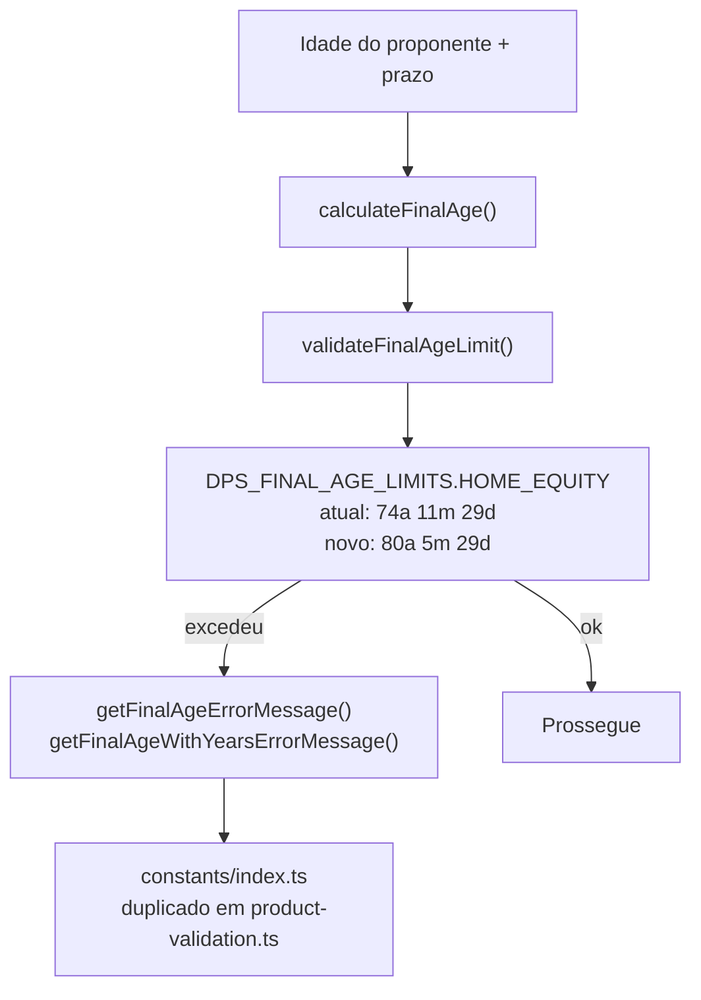

# Home Equity — Atualização do Limite de Idade

## Contexto

Novo limite: **80 anos, 5 meses e 29 dias** (igual ao MAG Habitacional).  
Isso implica `MAX_AGE = 80.4375` e `DPS_FINAL_AGE_LIMITS = { years: 80, months: 5, days: 29 }`.

## Fluxo de validação de idade



## Arquivos e alterações

### [src/constants/index.ts](src/constants/index.ts) — 4 pontos

**`DPS_PRODUCTS.HOME_EQUITY.MAX_AGE`** (linha 41)
```typescript
// De:
MAX_AGE: 75,
// Para:
MAX_AGE: 80.4375, // 80 anos + 5 meses + 29 dias
```

**`DPS_FINAL_AGE_LIMITS.HOME_EQUITY`** (linha 69)
```typescript
// De:
HOME_EQUITY: { years: 74, months: 11, days: 29 }, // Não pode ter 75 completos
// Para:
HOME_EQUITY: { years: 80, months: 5, days: 29 }, // Não pode ter mais de 80 anos, 5 meses e 29 dias
```

**`getFinalAgeErrorMessage`** — bloco `HOME_EQUITY` (linha 257-258)
```typescript
// De:
return `... não pode exceder 75 anos até o fim do contrato.`;
// Para:
return `... não pode exceder 80 anos, 5 meses e 29 dias até o fim do contrato.`;
```

**`getFinalAgeWithYearsErrorMessage`** — bloco `HOME_EQUITY` (linha 278-279)
```typescript
// De:
return `... não pode exceder 75 anos ao fim da operação.`;
// Para:
return `... não pode exceder 80 anos, 5 meses e 29 dias ao fim da operação.`;
```

### [src/utils/product-validation.ts](src/utils/product-validation.ts) — 2 pontos

As mesmas duas funções de mensagem existem duplicadas aqui (linhas 243-244 e 278-279). Mesmas substituições acima.

### [.cursor/skills/dps-produtos-context/products/home-equity.md](.cursor/skills/dps-produtos-context/products/home-equity.md) — 2 pontos

Atualizar a tabela de regras (linhas 15-16):

```markdown
// De:
| Idade máxima (referência `MAX_AGE`) | 75 anos |
| Idade ao fim do contrato | Não ultrapassar **74 anos, 11 meses e 29 dias** |

// Para:
| Idade máxima (referência `MAX_AGE`) | 80 anos e 5 meses |
| Idade ao fim do contrato | Não ultrapassar **80 anos, 5 meses e 29 dias** |
```

## Resumo

| Arquivo | Pontos |
|---|---|
| `src/constants/index.ts` | 4 |
| `src/utils/product-validation.ts` | 2 |
| `products/home-equity.md` | 2 |
| **Total** | **8** |
