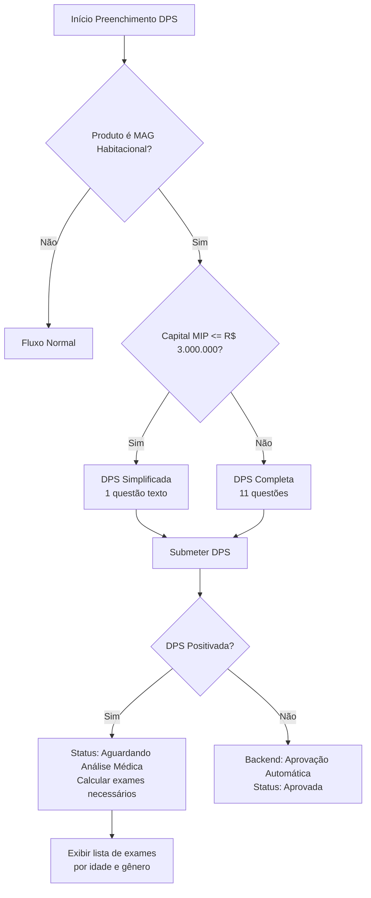

# Implementação do Produto MAG Habitacional - Canal BANESE

## Contexto

Implementar o produto MAG Habitacional para a Seguradora MAG (CNPJ 33.608.308/0001-73) no canal de venda BANESE, com regras específicas de idade, capital, DPS simplificada/completa, exames médicos e processamento automático.

## Configurações do Produto

### Limites de Idade

- Idade mínima: 18 anos completos
- Idade máxima final: ao final do prazo escolhido, o proponente não pode ter mais que 80 anos, 5 meses e 29 dias
- Limite de capital MIP: R$ 5.000.000,00
- Limite de capital DFI: R$ 8.000.000,00
- Limite máximo de prazo de financiamento: 240 meses

### DPS Simplificada vs Completa

- Capital ≤ R$ 3.000.000: DPS Simplificada (1 questão de texto aberta)
- Capital > R$ 3.000.000: DPS Completa (11 questões: 8 Sim/Não + 3 inputs de texto)

### Regras de Exames por Idade

- Idade ≤ 50 anos: Exames MÍNIMOS
- Idade > 51 e ≤ 60 anos: Exames MÍNIMOS + PSA (masculino) ou Ultrassonografia das mamas (feminino)
- Idade > 61 anos: Todos os anteriores + Exames COMPLETOS

### Processamento

- DPS Positivada → Status: Aguardando Análise Médica
- DPS Não Positivada (clean case) → Aprovação automática

## Arquivos a Modificar

### 1. Constantes e Tipos

#### `src/constants/index.ts`

- Adicionar `MAG_HABITACIONAL` em `DPS_PRODUCTS` com:
- MAX_AGE: 80.4375 (80 anos + 5 meses + 29 dias)
- MIN_AGE: 18
- NAMES: ['MAG Habitacional', 'MAG Habitacional BANESE']
- TYPE: 'MAG_HABITACIONAL'
- Adicionar limite de idade final em `DPS_FINAL_AGE_LIMITS`:
- MAG_HABITACIONAL: { years: 80, months: 5, days: 29 }
- Adicionar limites de capital em `DPS_CAPITAL_LIMITS`:
- MAG_HABITACIONAL: { MIP: 5_000_000, DFI: 8_000_000 }
- Adicionar função utilitária `isMagHabitacionalProduct(productName: string): boolean`
- Adicionar função `getDpsTypeByCapital(productName: string, capital: number): 'simplified' | 'complete'`

#### `src/types/product.ts`

- Atualizar `ProductConfiguration.type` para incluir `'MAG_HABITACIONAL'`
- Adicionar configuração de DPS type no `ProductConfiguration`:
  ```typescript
          dpsConfig?: {
            simplifiedThreshold?: number | null; // Capital threshold para DPS simplificada
            questions?: {
              simplified: Array<{ code: string; question: string; type: 'text' }>;
              complete: Array<{ code: string; question: string; type: 'yesno' | 'text' }>;
            };
          };
  ```


### 2. Questões da DPS

#### `src/app/(logged-area)/dps/fill-out/components/dps-form.tsx`

- Adicionar `diseaseNamesMagHabitacionalSimplified` com 1 questão de texto:
- '1': 'O proponente apresenta qualquer problema de saúde que afete suas atividades profissionais, esteve internado, fez qualquer cirurgia/biópsia nos últimos três anos ou tem ainda, conhecimento de qualquer condição médica que possa resultar em uma hospitalização ou cirurgia nos próximos meses? Não Em caso afirmativo, especificar.'
- Adicionar `diseaseNamesMagHabitacionalComplete` com 11 questões:
- Questões 1-8: Sim/Não (conforme especificação)
- Questões 9-11: Texto (altura, peso, sequelas COVID)

#### `src/app/(logged-area)/dps/fill-out/components/dps-health-form.tsx`

- Criar schema `productMagHabitacionalSimplified` com 1 campo de texto
- Criar schema `productMagHabitacionalComplete` com 11 campos (8 yes/no + 3 texto)
- Atualizar lógica de seleção de schema baseado no produto e capital
- Adicionar função `getMagHabitacionalDpsType(capital: number): 'simplified' | 'complete'`
- Modificar `DpsHealthForm` para aceitar `dpsType` como prop e renderizar questões apropriadas

### 3. Regras de Exames

#### `src/utils/product-validation.ts` (ou novo arquivo `src/utils/exam-rules.ts`)

- Criar constante `MAG_HABITACIONAL_EXAM_RULES`:
  ```typescript
          const MAG_HABITACIONAL_EXAM_RULES = {
            MINIMUM: [
              'Hb1Ac', 'Glicemia', 'Colesterol_total_HDL', 'Triglicerídeos',
              'Creatinina', 'TGO', 'TGP', 'Gama-GT', 'NT-proBNP', 'Eletrocardiograma_esforço',
              'HIV', 'Hemograma', 'PH', 'Proteinas', 'Glicose', 'Corpos_cetonicos',
              'Urobilinogenio', 'Bilirubinas', 'Celulas_epiteliais', 'Leucocitos',
              'Hemacias', 'Cristais', 'Filamentos_muco', 'Cilindros', 'Bacteria'
            ],
            PSA_OR_ULTRASOUND: (gender: 'M' | 'F') => 
              gender === 'M' ? ['PSA'] : ['Ultrassonografia_mamas'],
            COMPLETE: ['ECG', 'Teste_Esforco', 'Ecocardiograma']
          };
  ```


- Criar função `getRequiredExamsMagHabitacional(age: number, gender: 'M' | 'F'): string[]`
- Criar função utilitária para uso em outros componentes

### 4. Validação de Capital

#### `src/app/(logged-area)/dps/fill-out/components/dps-product-form.tsx`

- Adicionar validação específica para MAG Habitacional:
- Capital MIP máximo: R$ 5.000.000,00
- Capital DFI máximo: R$ 8.000.000,00
- Usar função `getMaxCapitalByProduct` com fallback para constantes
- Atualizar mensagens de erro para incluir limites específicos do MAG Habitacional

#### `src/utils/product-validation.ts`

- Adicionar função `getMaxCapitalMagHabitacional(type: 'MIP' | 'DFI'): number`
- Integrar com função híbrida existente

### 5. Processamento de DPS

#### `src/app/(logged-area)/dps/fill-out/components/dps-health-form.tsx`

- Após submit da DPS, verificar se é MAG Habitacional
- Se for MAG Habitacional e DPS não positivada (todas respostas "Não" ou texto vazio):
- Chamar endpoint backend para aprovação automática
- Atualizar status da proposta para "Aprovada Automaticamente"
- Se DPS positivada:
- Manter fluxo atual (Status: Aguardando Análise Médica)

#### `src/app/(logged-area)/dps/actions.ts`

- Criar função `postMagHabitacionalAutoApproval(token: string, uid: string): Promise<...>`
- Endpoint: `POST /api/v1/Proposal/${uid}/dps/auto-approve`
- Backend deve validar se DPS não está positivada e aprovar automaticamente

### 6. Integração com Formulário Inicial

#### `src/app/(logged-area)/dps/fill-out/components/dps-initial-form.tsx`

- Ao preencher capital MIP, determinar tipo de DPS (simplificada/completa)
- Passar informação do tipo de DPS para `DpsHealthForm`
- Validar limites de capital específicos do MAG Habitacional

### 7. Validação de Idade

#### `src/app/(logged-area)/dps/fill-out/components/dps-profile-form.tsx`

- Adicionar validação específica para MAG Habitacional
- Idade final não pode exceder 80 anos, 5 meses e 29 dias
- Usar função `validateFinalAgeLimitHybrid` com fallback

#### `src/app/(logged-area)/dps/fill-out/components/dps-product-form.tsx`

- Validar prazo máximo de 240 meses para MAG Habitacional
- Validar idade final considerando limite específico

### 8. Exibição de Exames Necessários

#### `src/app/(logged-area)/dps/components/med-reports.tsx`

- Adicionar lógica para exibir exames necessários baseado em idade e gênero
- Para MAG Habitacional, calcular exames usando `getRequiredExamsMagHabitacional`
- Exibir lista de exames necessários na interface

### 9. Componentes de UI

#### Criar componente `src/app/(logged-area)/dps/components/mag-habitacional-exams-list.tsx`

- Componente para exibir lista de exames necessários
- Mostrar exames agrupados por tipo (Mínimos, Adicionais, Completos)
- Indicar quais exames são específicos por gênero

## Fluxo de Processamento




## Validações Necessárias

1. **Idade**: 18 anos completos até 80 anos, 5 meses e 29 dias ao final do contrato
2. **Capital MIP**: Máximo R$ 5.000.000,00
3. **Capital DFI**: Máximo R$ 8.000.000,00
4. **Prazo**: Máximo 240 meses
5. **DPS**: Tipo determinado pelo capital MIP
6. **Exames**: Determinados por idade e gênero após DPS positivada

## Integração Backend

### Endpoints Necessários

1. **POST /api/v1/Proposal/{uid}/dps/auto-approve**

- Valida se DPS não está positivada
- Aprova automaticamente se válido
- Retorna novo status da proposta

2. **GET /api/v1/Product/{productUid}/dps-config**

- Retorna configuração de DPS (simplificada/completa)
- Retorna questões específicas do produto

3. **GET /api/v1/Proposal/{uid}/required-exams**

- Retorna lista de exames necessários baseado em idade, gênero e produto
- Para MAG Habitacional, aplica regras específicas

## Testes Necessários

1. Validação de idade mínima/máxima
2. Validação de capital MIP/DFI
3. Seleção correta de DPS simplificada vs completa
4. Renderização correta das questões
5. Cálculo correto de exames por idade/gênero
6. Aprovação automática quando DPS não positivada
7. Fluxo de análise médica quando DPS positivada

## Observações